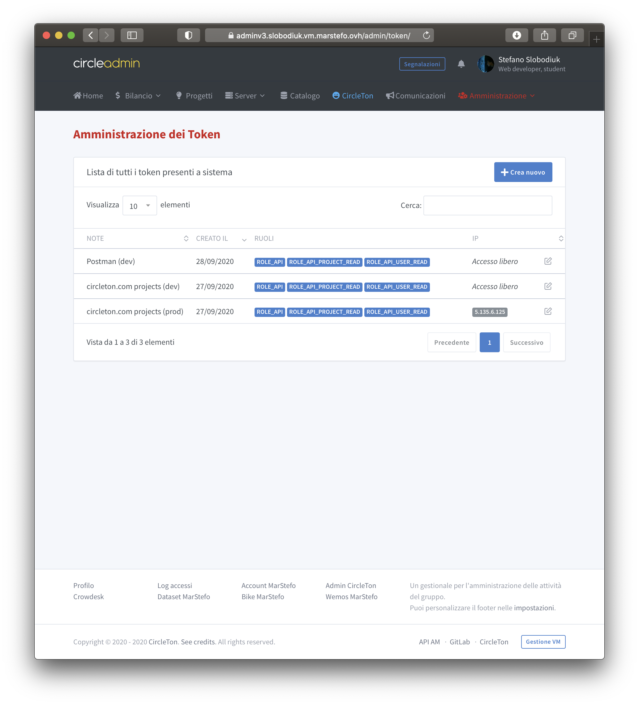

# API

## Purpose


This section is deprecated and must not be used for new clients.


Initially, the API was created to automatically update the people and the project in the official website of the group \(circleton.com\). But the API written in GO can improve the perfomance and also is a correct way of operate.

## Managing the tokens


To try the APIs: [https://adminv3.slobodiuk.vm.marstefo.ovh/api](https://adminv3.slobodiuk.vm.marstefo.ovh/api)


CircleAdmin can generate tokens to use in external clients with possibility to lock to specified IPs and assign roles.

