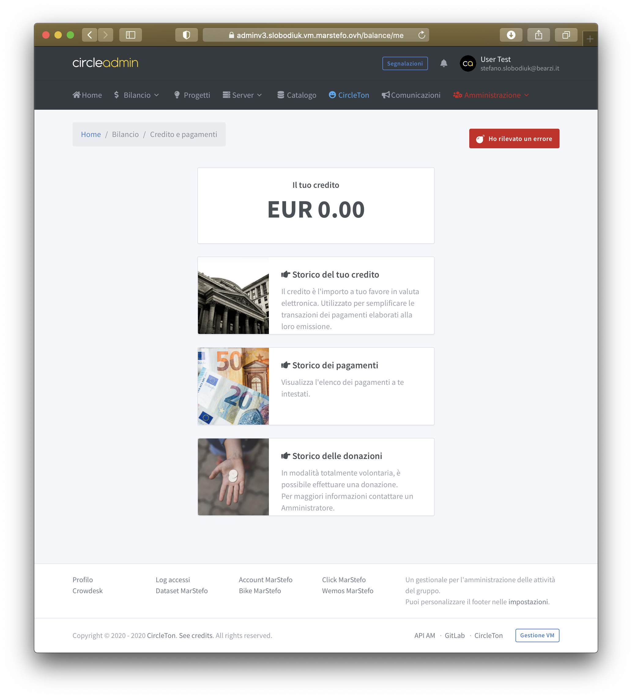
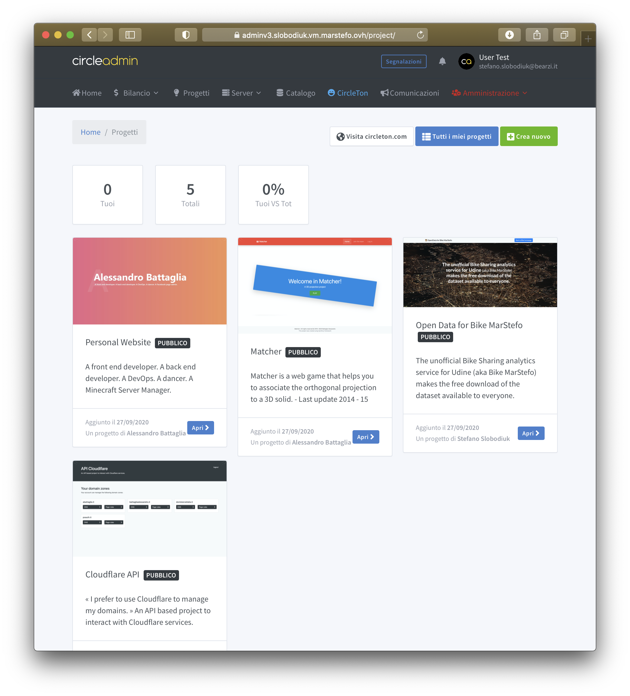
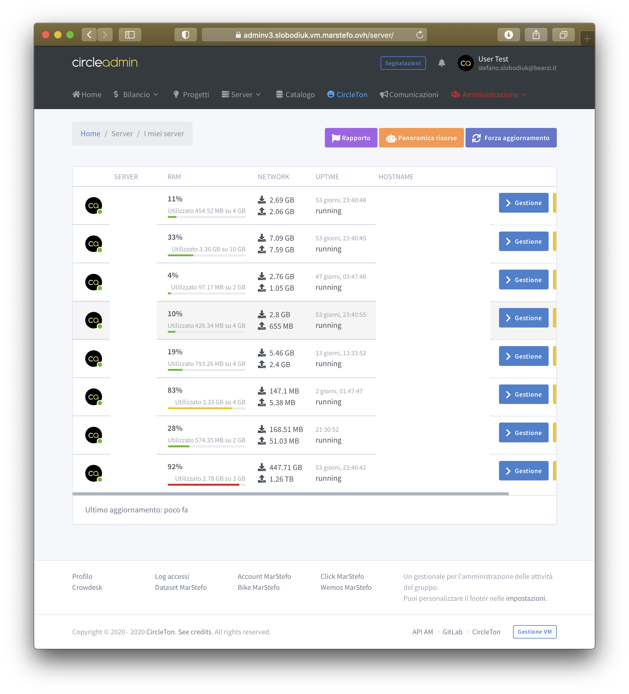
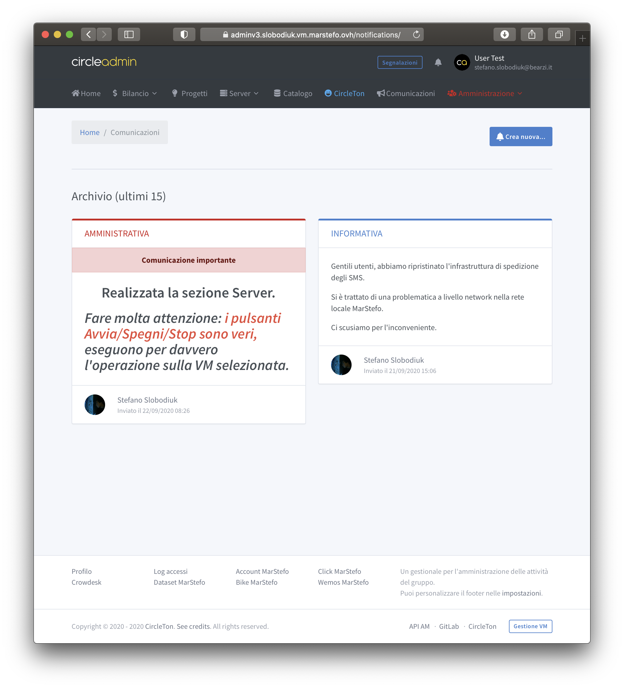

# Applications

## Budget

This application allows the user to view all his financial information. The user can see the budget history, payment history donations history. Also, the user can open a dispute if some information are wrong and the Admin team can reply easily from the dedicated area.  

### Pool

The pool page show a general balance calculated from all the expenses and income registered.  
There are, also, a button to open the Proposal application.

### General balance

The general balance page show a table filled with all the expenses and income registered on CircleAdmin. The data is grouped per year and show at the right the current balance reached.  

#### More in depth...

Once you have chosen the year, you can view the list of income and expenses. The outgoings are the paid Orders that the administration enters into the system and the amount subtracts the budget currently reached. The Orders records are highlighted in yellow. The income are the contributions of paying users. Their amount, which can vary according to the services it possesses, increases the amount of the budget. The income records do not have a distinctive highlight color, but those who have not paid will have the line highlighted in gray.

The balance is therefore a series of additions and subtractions updated to include the current record amount. The first budget line of the selected year is part of a budget calculation from previous years.

## Project

Project application is a complete CRUD used to manage the personal project of the user. Then, all the projects, ordered by date of creation, are shown in the index page and every user \(with role\) can see the details and go to the website \(if link was added\).

### Integrations

Project can support:

* **Click MarStefo**: The link shortener manager for MarStefo group
* **Website circleton.com**: This is the official site of the group that contains the collection of users and related \(and public\) projects.

## Server

Server application is dedicated to summarize the status of the servers with informations about ram/disk/swap usage.  
Also, the user can operate starting up and power off the vms \(lxc and qemu\).

The task page of a server contains the recents tasks executed, but all the logging relative to the user is saved in an Alert.



### Catalog


_This feature is in development._


### Meeting


_This feature is in development._


### Communication

Communication allow an users to send a message to other users. A message can be "Administrative" and "Informative" with possibility to set as important \(only admins\).  
Then, when the sender choses the recipients and the form is submitted, will be send by email, created an Alert and finally displayed on the homepage \(in the summary section\).

### Extras

CircleAdmin contais little services incapsulated in some parts of the web manager. Here you can read more:







