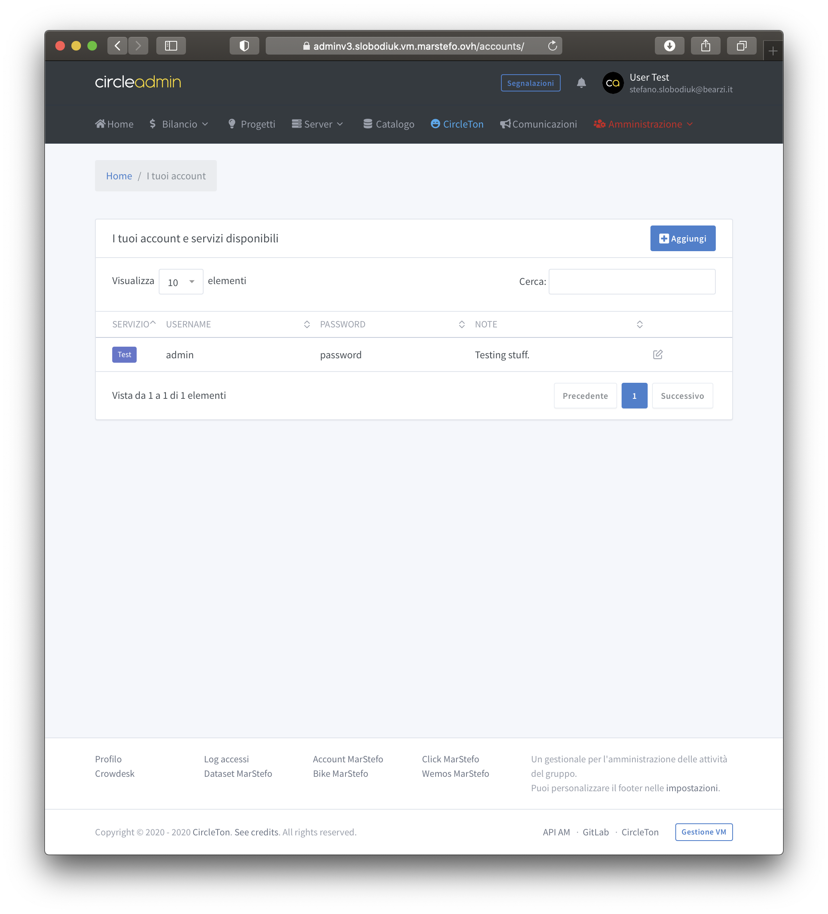

# Credentials

The Credentials application is a complete CRUD used to manage the credentials that belong to the user. Normally, this section is filled automatically by internal operations but the user can independently add his credentials.  

## Disclaimer

The Credentials service keeps the credentials in plaintext format, designed for use to services related to the group. The insertion of personal and unrelated credentials to the group is possible but the Administration assumes no responsibility in case of violation of the same. Rather, it is advisable to rely on applications such as Keychain Access \(Apple iCloud ecosystem\) or 1Password \(cross-platform\) or many others.

